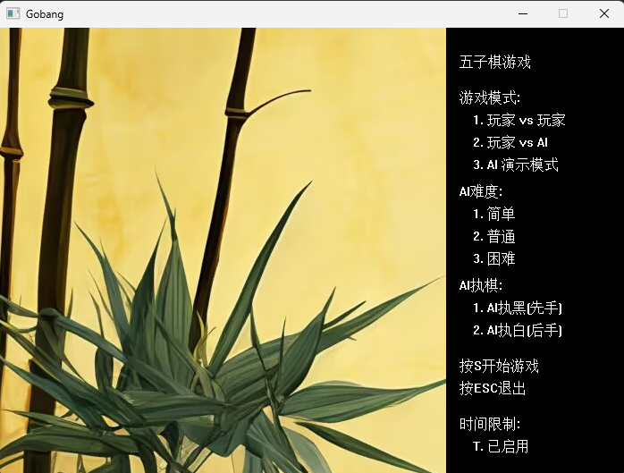
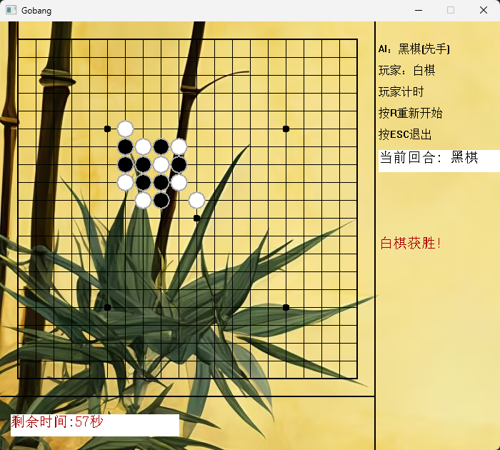

# Gobang-CPP

一个基于 C++ 与 [EasyX](https://easyx.cn) 图形库开发的 Windows 桌面五子棋项目，支持双人对战、人机对战和 AI 演示三种模式；人机模式提供简单 / 普通 / 困难三档 AI，并可启用单步限时。

本项目把原来 700 多行的单文件版本（`五子棋_FINAL.cpp`）按职责拆分成多个模块，玩法与原版一致；键盘与鼠标输入均改为在游戏窗口内直接响应。

## 目录结构

```text
Gobang-CPP/
├── CMakeLists.txt         # CMake 构建配置（可选）
├── Gomoku.slnx            # Visual Studio 解决方案（双击即可打开）
├── Gomoku.vcxproj         # Visual Studio 工程文件
├── README.md
├── .gitignore
├── assets/
│   ├── ChessUnderground.bmp   # 菜单和对局窗口的背景图
│   └── screenshots/           # README 使用的游戏截图
└── src/
    ├── main.cpp           # 程序入口
    ├── Config.h           # 常量与棋盘类型
    ├── GameState.h/.cpp   # 对局状态：棋盘、模式、回合、计时
    ├── Rules.h/.cpp       # 五子连珠胜负判定（纯逻辑）
    ├── AiPlayer.h/.cpp    # AI 选点与位置评估（纯逻辑）
    ├── GameUi.h/.cpp      # EasyX 游戏画面绘制
    ├── MainMenu.h/.cpp    # 主菜单
    └── GameSession.h/.cpp # 对局流程控制
```

## 运行环境

- Windows 10 / Windows 11
- Visual Studio（需要“使用 C++ 的桌面开发”工作负载）
- EasyX 图形库（[easyx.cn](https://easyx.cn)，安装时选择与你 VS 版本对应的选项）

> 仓库里的 `.slnx/.vcxproj` 在本机使用 VS 2026（平台工具集 v145）验证通过。如果你用的是 VS 2019 / 2022，打开工程时若提示工具集版本不匹配，把“平台工具集”改成你电脑已安装的版本（如 v143）即可；也可以按下面的“手动新建项目”方式创建。

## 编译运行

### 方式一：Visual Studio（推荐）

1. 安装 EasyX；
2. 双击 `Gomoku.slnx` 打开解决方案；
3. 顶部配置切换为 **Debug + x64**，按 **F5** 运行调试。

工程已配置 Unicode 字符集、`/utf-8`，并会在生成后自动把 `assets/ChessUnderground.bmp` 复制到 exe 所在目录，无需手动处理背景图。

### 方式二：手动新建 Visual Studio 项目

1. 安装 EasyX 后新建一个 C++ 空项目；
2. 把 `src/` 下所有 `.cpp` 与 `.h` 加入项目；
3. “项目属性 → 常规 → 字符集”设为 **使用 Unicode 字符集**；
4. 在“C/C++ → 命令行 → 其他选项”加入 `/utf-8`，避免中文注释或宽字符乱码；
5. 编译运行。

### 方式三：CMake

```bat
cmake -S . -B build
cmake --build build --config Release
```

CMake 需要 MSVC 工具链（EasyX 仅支持 MSVC）。若提示找不到 `EasyXw.lib`，可手动指定库目录后重新配置：

```bat
cmake -S . -B build -DEASYX_LIB_DIR="C:\Program Files\Microsoft Visual Studio\<版本>\Community\VC\Auxiliary\VS\lib\x64"
```

## 背景图说明

程序运行时依次查找 `ChessUnderground.bmp`：

1. 程序当前目录（exe 所在目录）；
2. `assets/ChessUnderground.bmp`（工程根目录下的相对路径）。

无论背景图是否存在，程序都可以运行；缺少背景图时菜单和对局窗口将没有背景。使用仓库自带的 VS 工程或 CMake 构建时，构建系统会自动完成复制。

## 操作说明

- 菜单：鼠标点击选项开始 / 设置，或按 `S` 开始、`T` 切换限时、`ESC` 退出；
- 对局：鼠标左键落子；`R` 重新开始；`ESC` 退出对局。

## 模块职责

| 模块 | 职责 |
| --- | --- |
| `GameState` | 保存棋盘、模式、难度、回合与计时状态 |
| `Rules` | 落子后的胜负判定，纯逻辑、不依赖界面 |
| `AiPlayer` | 位置评估与选点，纯逻辑、不依赖界面 |
| `GameUi` | EasyX 绘制：棋盘、棋子动画、倒计时、胜负提示 |
| `MainMenu` | 菜单窗口的绘制与输入 |
| `GameSession` | 驱动菜单之后的完整对局流程 |

## 游戏截图

### 主菜单



### 对局进行中


### 胜负判定


